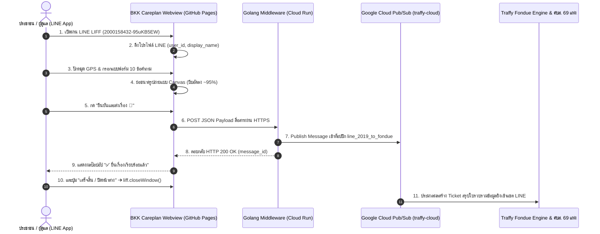

# 📋 เอกสารส่งมอบงานระบบ (Project Handoff Document)
## ระบบยื่นเรื่องขอรับการสนับสนุนผ้าอ้อมผู้ใหญ่ กรุงเทพมหานคร (BKK Careplan - Traffy Fondue)

---

## 📌 1. ภาพรวมระบบ (System Overview)

ระบบ **BKK Careplan - Traffy Fondue** เป็นเว็บแอปพลิเคชัน (Mobile-first Web Application) ที่พัฒนาขึ้นเพื่อทำหน้าที่เป็น **LINE LIFF Webview** สำหรับประชาชนและผู้ดูแลในพื้นที่กรุงเทพมหานคร ยื่นความประสงค์ขอรับการสนับสนุนผ้าอ้อมผู้ใหญ่และแผ่นรองซับการขับถ่าย 

ข้อมูลจากแบบฟอร์มจะถูกแปลงเป็น **JSON Payload** ที่ได้มาตรฐาน และส่งต่อไปยัง **Golang Cloud Run Middleware Gateway** เพื่อจัดส่งเข้าสู่ **Google Cloud Pub/Sub** ท็อปปิก `line_2019_to_fondue` ก่อนกระจายตั๋วคำร้องไปยังศูนย์บริการสาธารณสุข (ศบส. 69 แห่ง) ในพื้นที่ต่อไป

---

## 🔗 2. สรุปข้อมูลทางเทคนิคและ URL ประจำระบบ (Environment URLs & IDs)

| รายการ (Item) | ค่าการตั้งค่าระบบ (Configuration Value) |
| :--- | :--- |
| **GitHub Repository** | `https://github.com/traffy-nectec/bkk-careplan` |
| **Live Demo (GitHub Pages)** | [https://traffy-nectec.github.io/bkk-careplan/](https://traffy-nectec.github.io/bkk-careplan/) |
| **LINE LIFF URL จริง** | [https://liff.line.me/2000158432-95uKB5EW](https://liff.line.me/2000158432-95uKB5EW) |
| **LINE LIFF ID** | `2000158432-95uKB5EW` |
| **Cloud Run Gateway API URL** | `https://liff-form-gateway-884122932397.asia-southeast1.run.app/` |
| **GCP Project ID** | `traffy-cloud` |
| **GCP Pub/Sub Topic** | `line_2019_to_fondue` |

## ⚡ 3. สรุปเหตุการณ์หลักการทำงานของระบบ (Key Executive Trigger Events)

* **เปิดฟอร์มผ่าน LINE (LIFF Launch Trigger):** ดึงชื่อและโปรไฟล์ LINE ของผู้ยื่นเรื่องมาเชื่อมโยงอัตโนมัติ
* **เข้าสู่ข้อคำถามตำแหน่ง (Location Step Trigger):** ดึงพิกัด GPS ปัจจุบัน ปักหมุดแผนที่ และเติมชื่อ แขวง เขต รหัสไปรษณีย์ ให้อัตโนมัติ
* **เลือกสภาวะสุขภาพผู้ป่วย (Condition Selection Trigger):** หากเลือก "กลั้นไม่ได้" ระบบเปิดช่องแนบใบรับรองแพทย์ให้อัตโนมัติ หากเลือก "ติดเตียง" ระบบข้ามให้อัตโนมัติ
* **อัปโหลดรูปถ่าย (Image Compress Trigger):** คัดกรองเฉพาะไฟล์รูปภาพ พร้อมบีบอัดขนาดย่อลงอัตโนมัติ 95% (เหลือ ~150 KB) เพื่อการส่งผ่านมือถือที่รวดเร็ว
* **กดส่งเรื่อง (Submission Trigger):** ล็อกปุ่มป้องกันกดซ้ำ แสดงป๊อปอัปโหลดดิ้ง และส่งข้อมูลเข้าสู่ระบบ Cloud Run Gateway / Google Cloud Pub/Sub
* **ยื่นเรื่องสำเร็จ (Completion Trigger):** แสดงป๊อปอัปยืนยันการยื่นเรื่อง แจ้งผู้ใช้เรื่องการรับใบรวบรวมสรุปและแจ้งความคืบหน้าทางแชต LINE
* **กดปิดหน้าต่าง (Close Window Trigger):** เรียก `liff.closeWindow()` ปิดหน้าต่างเว็บกลับสู่หน้าแชต LINE ทันที

---

## 🏗️ 4. สถาปัตยกรรมระบบ (System Architecture & Pipeline)



---

## 🛠️ 4. โครงสร้างซอร์สโค้ดใน Repository

```
bkk-careplan/
├── index.html                  # หน้าเว็บ HTML5 Web App (Responsive UX/UI)
├── styles.css                  # Modern Responsive CSS System (BKK Emerald Theme)
├── app.js                      # Form Logic, Leaflet GPS Engine, Canvas Image Compression & LIFF SDK
├── gateway/                    # Golang Cloud Run Middleware Gateway Service
│   ├── main.go                 # Go Web Server, Pub/Sub Publisher & CORS Handler
│   ├── go.mod                  # Go Module dependencies
│   ├── Dockerfile              # Minimal Production Docker Image (<15MB)
│   └── README.md               # คู่มือการรันและ Deploy ขึ้น Google Cloud Run
├── docs/
│   ├── ai_prompting_guide.md   # คู่มือการสั่งงาน AI (Prompt Engineering Guide)
│   ├── context.md              # บริบท ที่มาโครงการ นโยบาย สปสช./กทม. & 2-Stage Data Model
│   ├── screenshots/            # ภาพถ่ายหน้าจอมือถือของทั้ง 13 ขั้นตอน
│   └── references/             # เอกสารอ้างอิงนโยบายและระเบียบ กทม./สปสช.
├── okf/
│   └── module_bkk_careplan.md  # OKF Technical Specification & Schema Definition
├── HANDOFF.md                  # เอกสารสรุปการส่งมอบงานระบบ (ไฟล์นี้)
├── README.md                   # คู่มือและคำอธิบายภาพรวมโครงการ
└── .gitignore
```

---

## 🔌 5. ข้อกำหนด JSON Payload Contract (Frontend ➔ Middleware)

```json
{
  "request_timestamp": "2026-08-07T10:15:00.000Z",
  "form_id": "bkk_careplan_diaper_v1",
  "form_name": "แบบแจ้งความประสงค์ขอรับผ้าอ้อมผู้ใหญ่",
  "liff_id": "2000158432-95uKB5EW",
  "source": "bkk_careplan_traffy_fondue_webview",
  "org_id": "BKK.HEALTH_CENTER.01",
  "applicant_type": "caregiver",
  "patient_info": {
    "fullname": "นายสมชาย ใจดี",
    "id_card": "1100200345670"
  },
  "contact_info": {
    "phone": "0812345678",
    "district": "หลักสี่",
    "subdistrict": "ทุ่งสองห้อง",
    "zipcode": "10210",
    "address_detail": "99/1 ซอยวิภาวดี 16 ถนนวิภาวดีรังสิต อาคาร A ชั้น 2",
    "landmark": "ตรงข้ามวัดบางนาใน",
    "full_address": "99/1 ซอยวิภาวดี 16 ถนนวิภาวดีรังสิต อาคาร A ชั้น 2 (จุดสังเกต: ตรงข้ามวัดบางนาใน) แขวงทุ่งสองห้อง เขตหลักสี่ กรุงเทพมหานคร 10210",
    "coordinates": {
      "latitude": 13.8821,
      "longitude": 100.5632
    }
  },
  "medical_conditions": {
    "condition": "incontinence",
    "is_bedridden": false,
    "has_incontinence": true,
    "medical_cert_count": 1
  },
  "caregiver_info": {
    "fullname": "นางสาวสมหญิง ใจดี (บุตรสาว)",
    "phone": "0898765432"
  },
  "attachments_count": 2,
  "images": {
    "medical_certs": [
      {
        "filename": "medical_cert_01.jpg",
        "base64": "data:image/jpeg;base64,/9j/4AAQSkZJRgABAQAAAQABAAD..."
      }
    ],
    "attachments": [
      {
        "filename": "patient_photo_01.jpg",
        "base64": "data:image/jpeg;base64,/9j/4AAQSkZJRgABAQAAAQABAAD..."
      }
    ]
  },
  "line_profile": {
    "user_id": "U1234567890abcdef1234567890abcdef",
    "display_name": "Somchai LINE",
    "picture_url": "https://profile.line-scdn.net/sample_picture_hash"
  }
}
```

---

## 🚀 6. การบริหารจัดการและปรับปรุงระบบในอนาคต (Deployment & Maintenance)

### ฝั่ง Frontend (GitHub Pages):
เมื่อแก้ไขซอร์สโค้ดในโฟลเดอร์หลัก สั่ง Push เข้าสาขา `main` ของ GitHub:
```bash
git add -A
git commit -m "feat: update frontend feature"
git push origin main
```
*ระบบ GitHub Pages จะทำการ Deploy หน้าเว็บเวอร์ชันใหม่อัตโนมัติภายใน 1-2 นาที*

### ฝั่ง Gateway Middleware (Google Cloud Run):
เมื่อแก้ไขซอร์สโค้ดในโฟลเดอร์ `gateway/`:
```bash
cd gateway
gcloud builds submit --tag gcr.io/traffy-cloud/liff-form-gateway .
gcloud run deploy liff-form-gateway \
  --image gcr.io/traffy-cloud/liff-form-gateway \
  --platform managed \
  --region asia-southeast1 \
  --allow-unauthenticated \
  --set-env-vars GCP_PROJECT_ID=traffy-cloud,PUBSUB_TOPIC=line_2019_to_fondue
```

---

## 📞 7. ทีมผู้พัฒนาและผู้รับผิดชอบ (Development Team)

* **หน่วยงานผู้รับผิดชอบ:** NECTEC / สวทช. ร่วมกับ กรุงเทพมหานคร และ สปสช.
* **ระบบหลัก:** Traffy Fondue & BKK Careplan System
