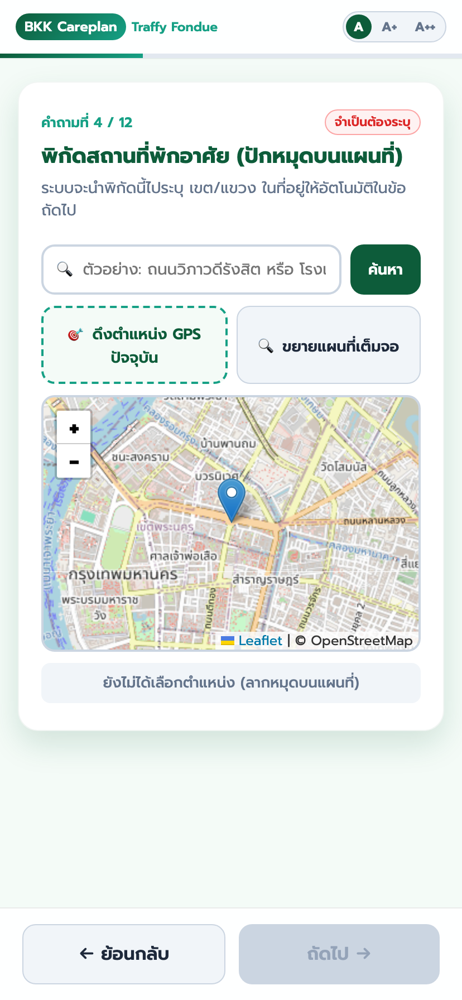
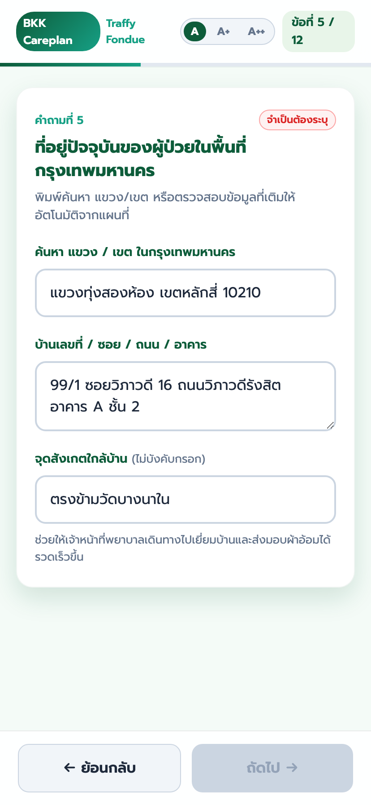
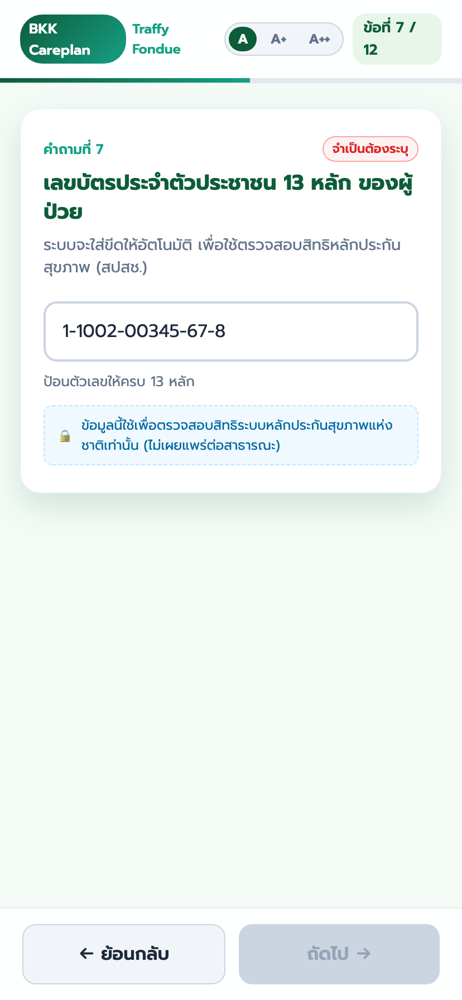
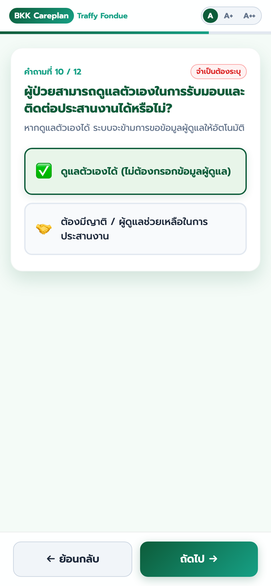
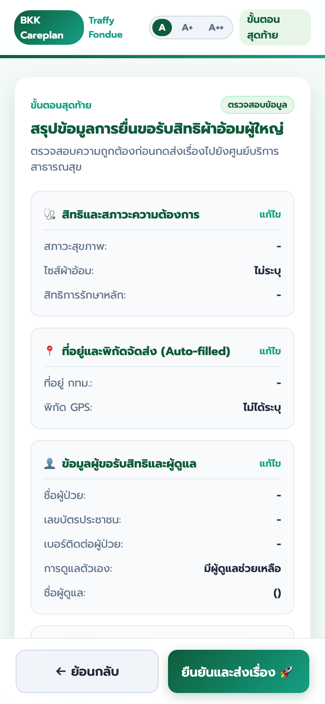

# ระบบยื่นเรื่องขอรับการสนับสนุนผ้าอ้อมผู้ใหญ่ กรุงเทพมหานคร (BKK Careplan - Traffy Fondue)

ระบบเว็บฟอร์มยื่นเรื่องขอรับการสนับสนุนผ้าอ้อมผู้ใหญ่และแผ่นรองซับการขับถ่าย สำหรับประชาชนและผู้ดูแลในพื้นที่กรุงเทพมหานคร โดยเชื่อมต่อข้อมูลเข้ากับระบบ **Traffy Fondue** และศูนย์บริการสาธารณสุข (ศบส.) กรุงเทพมหานคร

🌐 **ทดลองใช้งานระบบ (Live Demo):** [https://traffy-nectec.github.io/bkk-careplan/](https://traffy-nectec.github.io/bkk-careplan/)

---

## 📱 ภาพถ่ายตัวอย่างหน้าจอแอปพลิเคชัน (Mobile UI Screen Captures)

<div align="center">
  
  
  
</div>
<br>
<div align="center">
  
  
  
</div>

---

## 📊 สรุปการจัดลำดับและการตัด/รวมข้อคำถามจากเอกสารอ้างอิง (Question Mapping & Rationale)

จากการวิเคราะห์เอกสารแบบประเมินทางการแพทย์ของ สปสช. / กทม. (`แบบ 01, 02`) และกระบวนการรับเรื่องผ่าน Traffy Fondue ระบบได้ทำการปรับปรุงโครงสร้างคำถามให้อยู่ในรูปแบบ **12 ข้อคำถามย่อย (13 ขั้นตอน)** ตามตารางเปรียบเทียบดังนี้:

### 1. คำถามที่ตัดออก (Omitted Questions) และเหตุผลทาง UX/UI
| คำถามในเอกสารเดิม | ผลการพิจารณา | เหตุผลทางตรรกะและหลักการ UX/UI (Rationale) |
| :--- | :---: | :--- |
| **การประเมินคะแนน ADL 10 ข้อรายละเอียด** <br>*(กินอาหาร, อาบน้ำ, แต่งตัว, ส่องกระจก ฯลฯ)* | **ตัดออก** ❌ | สร้างภาระทางความคิด (Cognitive Load) สูงเกินไปสำหรับประชาชนทั่วไป และเป็นหน้าที่ประเมินทางการแพทย์ (Clinical Assessment) ของพยาบาลวิชาชีพ **สรุปเหลือปุ่มเลือกสภาวะ "ติดเตียง / กลั้นไม่ได้" ใน Step 2** แล้วให้ ศบส. ประเมินละเอียดตอนเยี่ยมบ้าน |
| **รหัสศูนย์บริการสาธารณสุข (ศบส. 69 แห่ง)** | **ตัดออก** ❌ | ประชาชนส่วนใหญ่ไม่ทราบรหัส ศบส. ที่ตนเองสังกัด **ระบบใช้พิกัด GPS (Step 4) + เขต/แขวง (Step 5)** ไปค้นหารหัส ศบส. ที่รับผิดชอบให้อัตโนมัติในฝั่ง Backend |
| **ประวัติการเจ็บป่วยเชิงลึก / โรคประจำตัวซับซ้อน** | **ตัดออก** ❌ | ไม่จำเป็นสำหรับการยื่นคำร้องขั้นต้น และเป็นข้อมูลส่วนบุคคลทางการแพทย์ระดับสูง (PDPA / Sensitive Data) ให้พยาบาลสอบถามเมื่อลงเยี่ยมบ้าน |
| **การลงนามของแพทย์ผู้ดูแล / หัวหน้า ศบส.** | **ตัดออก** ❌ | เป็นกระบวนการอนุมัติฝั่งเจ้าหน้าที่ (Internal Approval Chain) ประชาชนไม่จำเป็นต้องกรอกในขั้นแรก |

---

### 2. ตาราง Mapping คำถามเดิม ➔ 12 ข้อคำถามปัจจุบัน
| ข้อคำถามเดิมในเอกสาร | ตำแหน่งในระบบใหม่ | วัตถุประสงค์และประโยชน์ต่อระบบ |
| :--- | :---: | :--- |
| สถานะผู้ยื่นเรื่อง (ยื่นเอง/ยื่นแทน) | **คำถามที่ 1** | กำหนดบริบทการกรอกข้อมูล (Context Setting) |
| สภาวะป่วยติดเตียง / กลั้นไม่ได้ | **คำถามที่ 2** | คัดกรองสิทธิทางการแพทย์หลัก (Medical Eligibility Filter) |
| ขนาดรอบเอว / ไซส์ผ้าอ้อม | **คำถามที่ 3** | ระบุคุณลักษณะอุปกรณ์ที่ต้องการ (Product Attribute) |
| พิกัดสถานที่พักอาศัย GPS | **คำถามที่ 4** | **Location-First:** ดึงพิกัดอัตโนมัติ เพื่อส่งค่า แขวง/เขต ไปเติมในข้อ 5 |
| ที่อยู่ / แขวง / เขต / จุดสังเกต | **คำถามที่ 5** | **BKK Address Autocomplete:** ป้องกันพิมพ์ผิด + ช่องจุดสังเกต |
| ชื่อ - นามสกุล ผู้ป่วย | **คำถามที่ 6** | ระบุตัวตนผู้ป่วยผู้ขอรับสิทธิ |
| เลขบัตรประจำตัวประชาชน 13 หลัก | **คำถามที่ 7** | ตรวจสอบสิทธิหลักประกันสุขภาพ (สปสช.) แบบ Auto-format |
| สิทธิการรักษาพยาบาลหลัก | **คำถามที่ 8** | ตรวจสอบสิทธิ บัตรทอง / ประกันสังคม / ข้าราชการ |
| เบอร์โทรศัพท์ติดต่อนัดหมาย | **คำถามที่ 9** | ช่องทางให้เจ้าหน้าที่ ศบส. โทรนัดหมายประเมินเยี่ยมบ้าน |
| การช่วยเหลือดูแลตัวเอง | **คำถามที่ 10** | หากดูแลตัวเองได้ ระบบจะข้ามข้อ 11 ให้อัตโนมัติ |
| ข้อมูลญาติ / ผู้ดูแลหลัก | **คำถามที่ 11** | แสดงเฉพาะผู้ที่เลือก "ต้องมีผู้ดูแลช่วยเหลือ" |
| รูปถ่ายสถานที่ / ผู้ป่วย / ใบรับรองแพทย์ | **คำถามที่ 12** | หลักฐานประกอบเพื่อเร่งการพิจารณาอนุมัติ |
| สรุปข้อมูลการยื่นเรื่อง | **ขั้นตอนสุดท้าย (13)** | แสดงสรุป 4 การ์ดหมวดหมู่ พร้อมปุ่มแก้ไขเฉพาะจุด |

---

## ✨ จุดเด่นและฟีเจอร์หลัก (Key Features)

1. **Location-First & Reverse Geocoding อัตโนมัติ:**
   - เมื่อผู้ใช้ปักหมุดบนแผนที่ GPS ระบบจะดึงชื่อ **แขวง** และ **เขต** ในกรุงเทพมหานคร มาใส่ไว้ในที่อยู่อัตโนมัติ
2. **BKK Address Autocomplete สไตล์ `jquery.Thailand.js`:**
   - สามารถพิมพ์หรือเลือกตัวเลือก **แขวง / เขต / รหัสไปรษณีย์** ยอดนิยมของ กทม. ได้ทันทีเมื่อแตะช่องค้นหา ป้องกันการพิมพ์ชื่อแขวง/เขตผิด 100%
3. **จุดสังเกตใกล้บ้าน (Landmark Option):**
   - เพิ่มช่องกรอกจุดสังเกตใกล้บ้าน (ไม่บังคับ) ช่วยให้ทีมพยาบาลเยี่ยมบ้านของศูนย์บริการสาธารณสุขเดินทางไปส่งมอบผ้าอ้อมได้รวดเร็ว
4. **โครงสร้างคำถามเรียงตามหลักจิตวิทยา UX/UI (Progressive Disclosure):**
   - เรียงคำถามจาก บริบท ➔ สิทธิทางการแพทย์ ➔ พิกัด ➔ ที่อยู่ ➔ ยืนยันตัวตน ➔ การดูแล ➔ สรุปการยื่นเรื่อง
5. **Accessibility สำหรับผู้สูงอายุ (Font Scaling):**
   - ปรับขนาดตัวอักษรได้ 3 ระดับ (`A`, `A+`, `A++`) เพื่อผู้สูงอายุและผู้ป่วย

---

## 🛠️ โครงสร้างไฟล์ในโครงการ (Project Architecture)

```
bkk-careplan/
├── index.html                  # หน้าเว็บ HTML5 Web App (Responsive)
├── styles.css                  # Modern Responsive CSS System
├── app.js                      # Form Logic, Leaflet GPS & Autocomplete Engine
├── docs/
│   ├── context.md              # บริบท ที่มาของโครงการ นโยบาย สปสช./กทม. และ UX Rationale
│   ├── screenshots/            # ภาพถ่ายหน้าจอมือถือของทั้ง 13 ขั้นตอน
│   └── references/             # เอกสารอ้างอิงนโยบายและระเบียบ กทม./สปสช.
├── okf/
│   └── module_bkk_careplan.md  # OKF Technical Specification & Schema Definition
├── README.md                   # คู่มือและคำอธิบายโครงการ
└── .gitignore
```

---

## 🤝 การเชื่อมต่อระบบ (Integration & Payload)

ระบบส่งออกข้อมูลการยื่นเรื่องในรูปแบบ **JSON Payload** ที่รองรับการเชื่อมต่อ API กับ Traffy Fondue และระบบบริหารจัดการของกรุงเทพมหานคร (BKK Careplan Engine)
