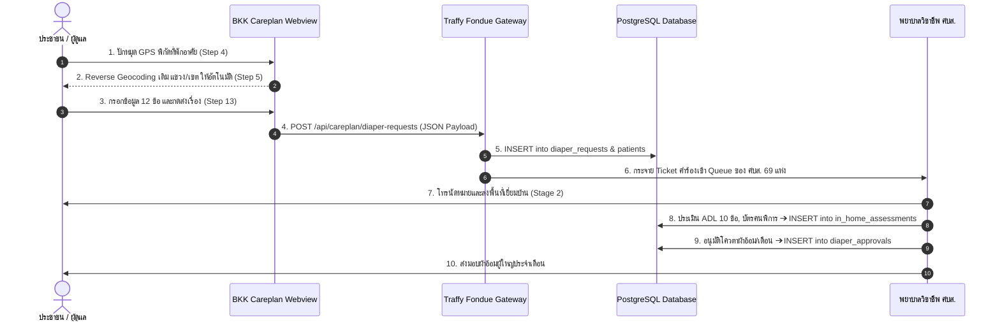
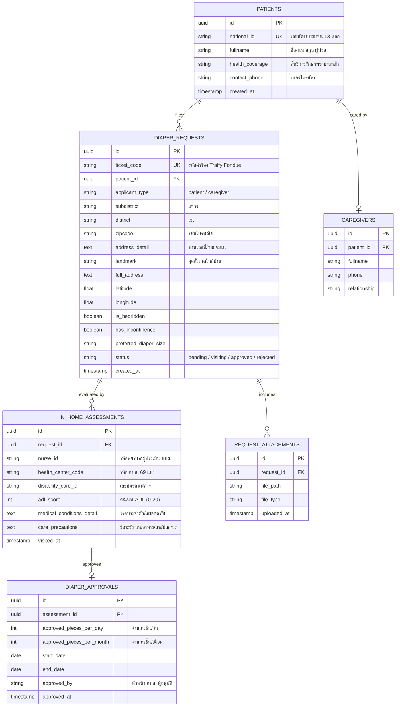
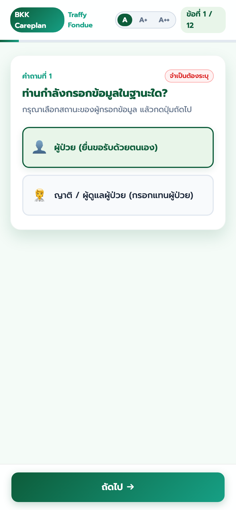
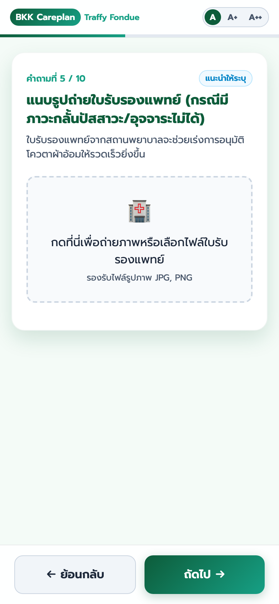
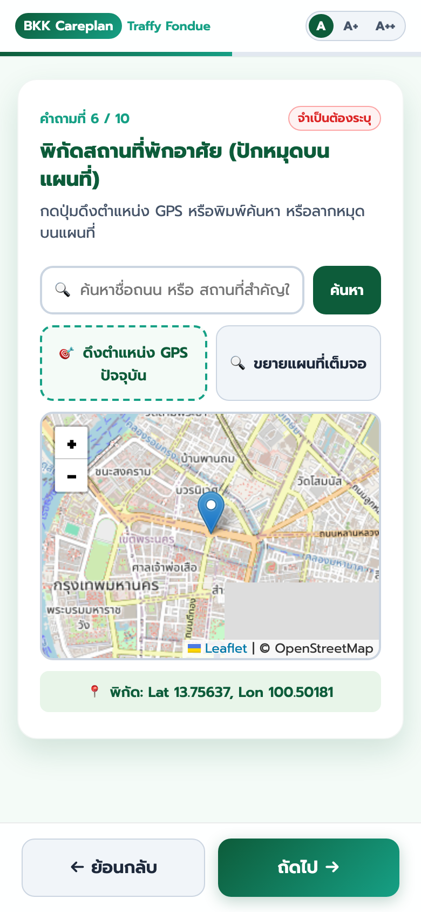
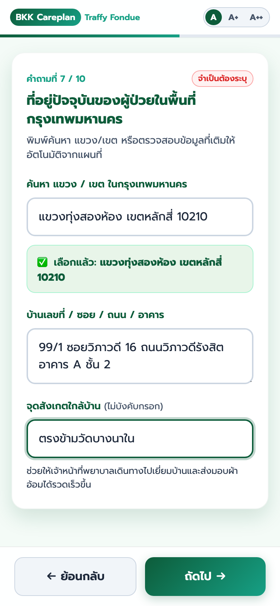
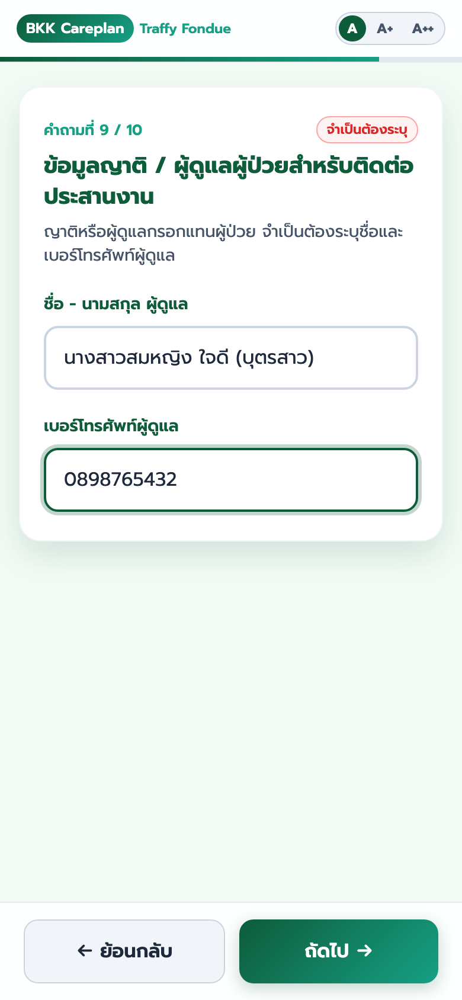
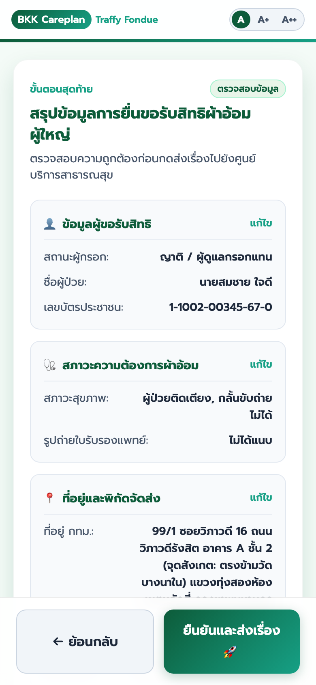

# ระบบยื่นเรื่องขอรับการสนับสนุนผ้าอ้อมผู้ใหญ่ กรุงเทพมหานคร (BKK Careplan - Traffy Fondue)

ระบบเว็บฟอร์มยื่นเรื่องขอรับการสนับสนุนผ้าอ้อมผู้ใหญ่และแผ่นรองซับการขับถ่าย สำหรับประชาชนและผู้ดูแลในพื้นที่กรุงเทพมหานคร โดยเชื่อมต่อข้อมูลเข้ากับระบบ **Traffy Fondue** และศูนย์บริการสาธารณสุข (ศบส.) กรุงเทพมหานคร

🌐 **ทดลองใช้งานระบบ (Live Demo):** [https://traffy-nectec.github.io/bkk-careplan/](https://traffy-nectec.github.io/bkk-careplan/)  
📲 **LINE LIFF App URL:** [https://liff.line.me/2000158432-95uKB5EW](https://liff.line.me/2000158432-95uKB5EW)  
⚙️ **Cloud Run Gateway API:** `https://liff-form-gateway-884122932397.asia-southeast1.run.app/`  
📋 **เอกสารส่งมอบงานระบบ (Handoff Document):** [HANDOFF.md](HANDOFF.md) | 📚 **คู่มือ AI:** [docs/ai_prompting_guide.md](docs/ai_prompting_guide.md)

---

## 🔁 แผนผังลำดับการส่งรับข้อมูล (End-to-End Sequence Diagram)



---

## 🗄️ โครงสร้างฐานข้อมูล PostgreSQL สำหรับระยะถัดไป (Phase 2 Backend Relational DB Schema)



---

## 📱 ภาพถ่ายตัวอย่างหน้าจอแอปพลิเคชัน (Mobile UI Screen Captures)

<div align="center">
  
  
  
</div>
<br>
<div align="center">
  
  
  
</div>

---

## 🏥 สถาปัตยกรรมเก็บข้อมูล 2 ระยะ (2-Stage Data Collection Model)

ข้อคำถามในแบบประเมิน `Diapers 01-2` ถูกแบ่งออกเป็น 2 ระยะ เพื่อประสิทธิภาพสูงสุดในการให้บริการประชาชน:

```
[ Stage 1: Citizen Intake Form ]       ➔       [ Stage 2: Clinical In-Home Visit ]
(ยื่นคำร้องผ่านมือถือ 12 ข้อคำถาม)                (พยาบาลวิชาชีพ ศบส. ประเมินเมื่อเยี่ยมบ้าน)
  • ปักหมุดพิกัด GPS & ที่อยู่ กทม.                   • ตรวจสอบบัตรคนพิการ & สิทธิสวัสดิการ
  • สภาวะติดเตียง / กลั้นไม่ได้                        • ประเมินคะแนน ADL 10 ข้อรายละเอียด
  • เลขบัตร 13 หลัก & เบอร์ติดต่อ                    • บันทึกโรคประจำตัว, แผลกดทับ & ข้อระวัง
  • ไซส์ผ้าอ้อม & ผู้ดูแล                            • อนุมัติโควตาผ้าอ้อม/เดือน & Care Plan
```

### คำถามในแบบ 01-2 ที่อยู่ใน Stage 2 (เมื่อพยาบาล ศบส. ลงเยี่ยมบ้าน):
* **บัตรคนพิการ & สิทธิคนพิการ:** เลขบัตรคนพิการ / สิทธิสวัสดิการ พม.
* **สถานะสุขภาพ & ประวัติโรคประจำตัว:** โรคสโตรก, สมองเสื่อม, อัมพฤกษ์/อัมพาต, แผลกดทับ (Stage 1-4)
* **ข้อระวังและคำแนะนำในการดูแล:** สายอาหาร (NG Tube), สายปัสสาวะ (Foley Cath), ภาวะติดเชื้อ, การแพ้วัสดุ
* **การประเมินคะแนน ADL (10 ข้อ):** ประเมินทักษะการดำเนินชีวิตประจำวันอย่างเป็นทางการ เพื่อตั้งเบิกงบประมาณ กองทุนหลักประกันสุขภาพ กทม.

---

## 📊 สรุปการจัดลำดับและการตัด/รวมข้อคำถามใน Stage 1 (Question Mapping)

จากการวิเคราะห์เอกสารแบบประเมินทางการแพทย์ของ สปสช. / กทม. (`แบบ 01, 02`) และกระบวนการรับเรื่องผ่าน Traffy Fondue ระบบได้ทำการปรับปรุงโครงสร้างคำถามให้อยู่ในรูปแบบ **10 ข้อคำถามย่อย (11 ขั้นตอน)** ตามตารางเปรียบเทียบดังนี้:

### 1. คำถามที่ปรับไปไว้ Stage 2 (Omitted from Stage 1) และเหตุผลทาง UX/UI
| คำถามในเอกสารเดิม | ย้ายไปอยู่ที่ไหน | เหตุผลทางตรรกะและหลักการ UX/UI (Rationale) |
| :--- | :---: | :--- |
| **ไซส์ผ้าอ้อม / สิทธิการรักษาหลัก / การช่วยเหลือตัวเอง** | **Stage 2 (ศบส. เยี่ยมบ้าน)** 🩺 | ปรับลดเพื่อความกระชับ ให้พยาบาลวิชาชีพสอบถามและประเมินเมื่อลงเยี่ยมบ้าน |
| **บัตรคนพิการ / ประวัติโรคประจำตัว / ข้อระวังการดูแล** | **Stage 2 (ศบส. เยี่ยมบ้าน)** 🩺 | เป็นข้อมูลสุขภาพเชิงลึก ให้พยาบาลวิชาชีพสอบถามและประเมินเมื่อลงเยี่ยมบ้าน เพื่อป้องกันภาระการกรอกคำร้องเบื้องต้นของผู้สูงอายุ/ผู้ดูแล |
| **การประเมินคะแนน ADL 10 ข้อรายละเอียด** <br>*(กินอาหาร, อาบน้ำ, แต่งตัว ฯลฯ)* | **Stage 2 (ศบส. เยี่ยมบ้าน)** 🩺 | เป็นการประเมินทางการแพทย์ (Clinical Assessment) **ใน Stage 1 สรุปเหลือปุ่มเลือกสภาวะ "ติดเตียง / กลั้นไม่ได้" ในข้อ 4** |
| **รหัสศูนย์บริการสาธารณสุข (ศบส. 69 แห่ง)** | **Backend System** ⚙️ | ประชาชนไม่ทราบรหัส ศบส. **ระบบใช้พิกัด GPS (ข้อ 6) + เขต/แขวง (ข้อ 7)** ไปค้นหารหัส ศบส. ที่รับผิดชอบให้อัตโนมัติ |
| **การลงนามของแพทย์ผู้ดูแล / หัวหน้า ศบส.** | **Internal Workflow** 🏛️ | เป็นกระบวนการอนุมัติฝั่งเจ้าหน้าที่ (Internal Approval Chain) |

---

### 2. ตาราง Mapping คำถาม Stage 1 (10 ข้อคำถามย่อย)
| ข้อคำถามเดิมในเอกสาร | ตำแหน่งในระบบใหม่ | วัตถุประสงค์และประโยชน์ต่อระบบ |
| :--- | :---: | :--- |
| สถานะผู้ยื่นเรื่อง (ยื่นเอง/ยื่นแทน) | **คำถามที่ 1** | กำหนดบริบทการกรอกข้อมูล (Context Setting) |
| ชื่อ - นามสกุล ผู้ป่วย | **คำถามที่ 2** | ระบุตัวตนผู้ป่วยผู้ขอรับสิทธิ (ย้ายต่อท้ายข้อ 1) |
| เลขบัตรประจำตัวประชาชน 13 หลัก | **คำถามที่ 3** | ตรวจสอบสิทธิหลักประกันสุขภาพ (สปสช.) แบบ Auto-format |
| ผู้ป่วยมีภาวะใดที่ทำให้จำเป็นต้องใช้ผ้าอ้อมผู้ใหญ่ | **คำถามที่ 4** | คัดกรองสิทธิทางการแพทย์หลัก (เลือก 1 ข้อ: ติดเตียง หรือ กลั้นไม่ได้) |
| แนบรูปถ่ายใบรับรองแพทย์ | **คำถามที่ 5 (Conditional Step)** ✨ | **แสดงเฉพาะผู้ที่เลือก "กลั้นไม่ได้" ในข้อ 4** *(ข้ามให้อัตโนมัติหากไม่เข้าเงื่อนไข)* |
| พิกัดสถานที่พักอาศัย GPS | **คำถามที่ 6** | **Location-First:** ดึงพิกัดอัตโนมัติ เพื่อส่งค่า แขวง/เขต ไปเติมในข้อ 7 |
| ที่อยู่ / แขวง / เขต / จุดสังเกต | **คำถามที่ 7** | **BKK Address Autocomplete:** ป้องกันพิมพ์ผิด + ช่องจุดสังเกต |
| เบอร์โทรศัพท์ติดต่อนัดหมาย | **คำถามที่ 8** | ช่องทางให้เจ้าหน้าที่ ศบส. โทรนัดหมายประเมินเยี่ยมบ้าน |
| ข้อมูลญาติ / ผู้ดูแลหลัก | **คำถามที่ 9** | **ยื่นเอง = Optional / ญาติยื่นแทน = Required** |
| รูปถ่ายสถานที่ / ผู้ป่วย | **คำถามที่ 10** | แนบหลักฐานประกอบสถานที่และผู้ป่วย (ไม่บังคับ) |
| สรุปข้อมูลการยื่นเรื่อง | **ขั้นตอนสุดท้าย (11)** | แสดงสรุป 5 การ์ดหมวดหมู่ พร้อมปุ่มแก้ไขเฉพาะจุด |

---

## ✨ จุดเด่นและฟีเจอร์หลัก (Key Features)

1. **Auto GPS Fetching & Reverse Geocoding อัตโนมัติ:**
   - ทันทีที่เข้าสู่ข้อคำถามที่ 6 ระบบจะเรียกสิทธิ์และดึงตำแหน่ง GPS ปัจจุบันของผู้ใช้มาปักหมุดบนแผนที่ให้อัตโนมัติ พร้อมค้นหาชื่อ **แขวง** และ **เขต** ในกรุงเทพมหานครส่งต่อไปเติมในข้อ 7 ให้อัตโนมัติโดยไม่ต้องเสียเวลากดปุ่มดึงตำแหน่ง
2. **BKK Address Autocomplete สไตล์ `jquery.Thailand.js`:**
   - สามารถพิมพ์หรือเลือกตัวเลือก **แขวง / เขต / รหัสไปรษณีย์** ยอดนิยมของ กทม. ได้ทันทีเมื่อแตะช่องค้นหา ป้องกันการพิมพ์ชื่อแขวง/เขตผิด 100%
3. **จุดสังเกตใกล้บ้าน (Landmark Option):**
   - เพิ่มช่องกรอกจุดสังเกตใกล้บ้าน (ไม่บังคับ) ช่วยให้ทีมพยาบาลเยี่ยมบ้านของศูนย์บริการสาธารณสุขเดินทางไปส่งมอบผ้าอ้อมได้รวดเร็ว
4. **โครงสร้างคำถามเรียงตามหลักจิตวิทยา UX/UI (Progressive Disclosure):**
   - เรียงคำถามจาก บริบท ➔ สิทธิทางการแพทย์ ➔ พิกัด ➔ ที่อยู่ ➔ ยืนยันตัวตน ➔ การดูแล ➔ สรุปการยื่นเรื่อง
### ⚡ สรุปเหตุการณ์หลักในระบบ (Key Executive Trigger Events)
* **เปิดฟอร์มผ่าน LINE (LIFF Launch Trigger):** ดึงชื่อและโปรไฟล์ LINE ของผู้ยื่นเรื่องมาเชื่อมโยงอัตโนมัติ
* **เข้าสู่ข้อคำถามตำแหน่ง (Location Step Trigger):** ดึงพิกัด GPS ปัจจุบัน ปักหมุดแผนที่ และเติมชื่อ แขวง เขต รหัสไปรษณีย์ ให้อัตโนมัติ
* **เลือกสภาวะสุขภาพผู้ป่วย (Condition Selection Trigger):** หากเลือก "กลั้นไม่ได้" ระบบเปิดช่องแนบใบรับรองแพทย์ให้อัตโนมัติ หากเลือก "ติดเตียง" ระบบข้ามให้อัตโนมัติ
* **อัปโหลดรูปถ่าย (Image Compress Trigger):** คัดกรองเฉพาะไฟล์รูปภาพ พร้อมบีบอัดขนาดย่อลงอัตโนมัติ 95% (เหลือ ~150 KB) เพื่อการส่งผ่านมือถือที่รวดเร็ว
* **กดส่งเรื่อง (Submission Trigger):** ล็อกปุ่มป้องกันกดซ้ำ แสดงป๊อปอัปโหลดดิ้ง และส่งข้อมูลเข้าสู่ระบบ Cloud Run Gateway / Google Cloud Pub/Sub
* **ยื่นเรื่องสำเร็จ (Completion Trigger):** แสดงป๊อปอัปยืนยันการยื่นเรื่อง แจ้งผู้ใช้เรื่องการรับใบรวบรวมสรุปและแจ้งความคืบหน้าทางแชต LINE
* **กดปิดหน้าต่าง (Close Window Trigger):** เรียก `liff.closeWindow()` ปิดหน้าต่างเว็บกลับสู่หน้าแชต LINE ทันที

---

## 🛠️ โครงสร้างไฟล์ในโครงการ (Project Architecture)

```
bkk-careplan/
├── index.html                  # หน้าเว็บ HTML5 Web App (Responsive)
├── styles.css                  # Modern Responsive CSS System
├── app.js                      # Form Logic, Leaflet GPS & Autocomplete Engine
├── gateway/                    # Golang Cloud Run Middleware Gateway Service
│   ├── main.go                 # Go Web Server & Pub/Sub Publisher
│   ├── go.mod                  # Go Module definition
│   ├── Dockerfile              # Minimal Docker Build Image (<15MB)
│   └── README.md               # คู่มือการรันและ Deploy ขึ้น Google Cloud Run
├── docs/
│   ├── ai_prompting_guide.md   # คู่มือการสั่งงาน AI (Prompt Engineering Guide)
│   ├── context.md              # บริบท ที่มาโครงการ นโยบาย สปสช./กทม. & 2-Stage Data Model
│   ├── screenshots/            # ภาพถ่ายหน้าจอมือถือของทั้ง 13 ขั้นตอน
│   └── references/             # เอกสารอ้างอิงนโยบายและระเบียบ กทม./สปสช.
├── okf/
│   └── module_bkk_careplan.md  # OKF Technical Specification & Schema Definition
├── HANDOFF.md                  # เอกสารสรุปการส่งมอบงานระบบ (Handoff Document)
├── README.md                   # คู่มือและคำอธิบายโครงการ
└── .gitignore
```

---

## 🤝 การเชื่อมต่อระบบและการส่งต่อข้อมูล (Integration & Middleware Contract)

ระบบส่งออกข้อมูลการยื่นเรื่องในรูปแบบ **JSON Payload** ที่รองรับการเชื่อมต่อ API กับ Middleware Backend ก่อนยิงเข้า Google Cloud Pub/Sub (`traffy-cloud` / `line_2019_to_fondue`) ต่อไป โดยมีการระบุตัวแปร `org_id` สำหรับระบุรหัสหน่วยงานปลายทางไว้ล่วงหน้า

### 📋 Checklist สิ่งที่ Middleware Backend ต้องทำ (Middleware Requirements):
- [x] **CORS Support:** รองรับ `Access-Control-Allow-Origin: *` สำหรับเรียกผ่าน `fetch()` บน LIFF / GitHub Pages
- [x] **Multi-Form Routing:** อ่านตัวแปร `form_id` และ `liff_id` ใน Payload เพื่อแยกแยะแบบฟอร์ม
- [x] **Metadata Attributes:** แนบ `form_id`, `org_id`, `liff_id`, `source`, `timestamp` ใส่ลงใน Pub/Sub Message Attributes
- [x] **Base64 Image Decoding / Forwarding:** จัดการรูปถ่าย `images.medical_certs` และ `images.attachments` (ย่อขนาดมาแล้วจาก Frontend)
- [x] **GCP Pub/Sub Integration:** Publish ข้อความเข้า Topic `line_2019_to_fondue` บน Project `traffy-cloud`
- [x] **Clean JSON Response:** ตอบกลับ `HTTP 200 OK` พร้อม `success: true` และ `message_id` ให้ฝั่ง LIFF แสดงป๊อปอัปสำเร็จ

---

## 🔌 ตัวอย่าง JSON Payload สำหรับ Middleware Developer

```json
{
  "request_timestamp": "2026-08-07T10:15:00.000Z",
  "form_id": "bkk_careplan_diaper_v1",
  "form_name": "แบบแจ้งความประสงค์ขอรับผ้าอ้อมผู้ใหญ่",
  "liff_id": "2000158432-95uKB5EW",
  "source": "bkk_careplan_traffy_fondue_webview",
  "org_id": "BKK.HEALTH_CENTER.01",
  "applicant_type": "caregiver",
  "patient_info": {
    "fullname": "นายสมชาย ใจดี",
    "id_card": "1100200345670"
  },
  "contact_info": {
    "phone": "0812345678",
    "district": "หลักสี่",
    "subdistrict": "ทุ่งสองห้อง",
    "zipcode": "10210",
    "address_detail": "99/1 ซอยวิภาวดี 16 ถนนวิภาวดีรังสิต อาคาร A ชั้น 2",
    "landmark": "ตรงข้ามวัดบางนาใน",
    "full_address": "99/1 ซอยวิภาวดี 16 ถนนวิภาวดีรังสิต อาคาร A ชั้น 2 (จุดสังเกต: ตรงข้ามวัดบางนาใน) แขวงทุ่งสองห้อง เขตหลักสี่ กรุงเทพมหานคร 10210",
    "coordinates": {
      "latitude": 13.8821,
      "longitude": 100.5632
    }
  },
  "medical_conditions": {
    "condition": "incontinence",
    "is_bedridden": false,
    "has_incontinence": true,
    "medical_cert_count": 1
  },
  "caregiver_info": {
    "fullname": "นางสาวสมหญิง ใจดี (บุตรสาว)",
    "phone": "0898765432"
  },
  "attachments_count": 2,
  "images": {
    "medical_certs": [
      {
        "filename": "medical_cert_01.jpg",
        "base64": "data:image/jpeg;base64,/9j/4AAQSkZJRgABAQAAAQABAAD..."
      }
    ],
    "attachments": [
      {
        "filename": "patient_photo_01.jpg",
        "base64": "data:image/jpeg;base64,/9j/4AAQSkZJRgABAQAAAQABAAD..."
      }
    ]
  },
  "line_profile": {
    "user_id": "U1234567890abcdef1234567890abcdef",
    "display_name": "Somchai LINE",
    "picture_url": "https://profile.line-scdn.net/sample_picture_hash"
  }
}
```

### 📝 คำอธิบายฟิลด์ใน JSON Payload (Data Field Definitions)

| ฟิลด์ (Field) | ประเภท (Type) | คำอธิบาย (Description) |
| :--- | :---: | :--- |
| `request_timestamp` | String (ISO8601) | วันเวลาที่ยื่นคำร้องแบบ UTC |
| `form_id` | String | รหัสอ้างอิงฟอร์มสำหรับ Gateway Router (`"bkk_careplan_diaper_v1"`) |
| `form_name` | String | ชื่อแบบฟอร์มประเมิน |
| `liff_id` | String | รหัส LINE LIFF Application ID |
| `source` | String | ระบบต้นทางของคำร้อง |
| `org_id` | String / Array | รหัสหน่วยงานปลายทาง หรือ รหัส ศบส. ที่รับผิดชอบ |
| `applicant_type` | String | สถานะผู้ยื่นเรื่อง (`"patient"` = ผู้ป่วยยื่นเอง, `"caregiver"` = ญาติยื่นแทน) |
| `patient_info.fullname` | String | ชื่อ-นามสกุล ของผู้ป่วย |
| `patient_info.id_card` | String | เลขบัตรประจำตัวประชาชน 13 หลัก (เฉพาะตัวเลข) |
| `contact_info.phone` | String | เบอร์โทรศัพท์สำหรับติดต่อนัดหมาย |
| `contact_info.district` | String | ชื่อเขตในกรุงเทพมหานคร |
| `contact_info.subdistrict` | String | ชื่อแขวงในกรุงเทพมหานคร |
| `contact_info.zipcode` | String | รหัสไปรษณีย์ |
| `contact_info.address_detail` | String | บ้านเลขที่ ซอย ถนน อาคาร |
| `contact_info.landmark` | String | จุดสังเกตใกล้บ้าน (ถ้ามี) |
| `contact_info.full_address` | String | ที่อยู่ฉบับเต็มประกอบสำเร็จ |
| `contact_info.coordinates` | Object | พิกัดละติจูดและลองจิจูดจากแผนที่ GPS |
| `medical_conditions.condition` | String | สภาวะหลักของผู้ป่วย (`"bedridden"` = ติดเตียง, `"incontinence"` = กลั้นไม่ได้) |
| `medical_conditions.is_bedridden` | Boolean | เป็นผู้ป่วยติดเตียงหรือไม่ |
| `medical_conditions.has_incontinence` | Boolean | มีภาวะกลั้นปัสสาวะ/อุจจาระไม่ได้หรือไม่ |
| `medical_conditions.medical_cert_count` | Number | จำนวนไฟล์ใบรับรองแพทย์ที่แนบมา |
| `caregiver_info.fullname` | String | ชื่อ-นามสกุล ผู้ดูแล/ญาติผู้ติดต่อ |
| `caregiver_info.phone` | String | เบอร์โทรศัพท์ของผู้ดูแล/ญาติ |
| `attachments_count` | Number | จำนวนรูปถ่ายผู้ป่วย/สถานที่แนบประกอบ |
| `images.medical_certs` | Array | อาเรย์ของรูปถ่ายใบรับรองแพทย์ (`filename`, `base64` Data URL) |
| `images.attachments` | Array | อาเรย์ของรูปถ่ายสถานที่/ผู้ป่วย (`filename`, `base64` Data URL) |
| `line_profile` | Object / null | ข้อมูลโปรไฟล์ LINE LIFF (`user_id`, `display_name`, `picture_url`) |

---

## 🖼️ การส่งไฟล์รูปภาพไปยัง Middleware (Image Transfer Mechanism)

ในฝั่ง Frontend เมื่อประชาชนถ่ายภาพหรือเลือกไฟล์รูปภาพ (ใบรับรองแพทย์ หรือ รูปถ่ายสถานที่) ระบบจะแปลงเป็น **Base64 Data URL** ให้อัตโนมัติและบรรจุอยู่ในวัตถุ `images` ของ JSON Payload:

### ขั้นตอนการประมวลผลฝั่ง Middleware Backend:
1. **Decode Base64 Data:** Middleware รับ JSON Payload แล้วดึงข้อมูลสตริง `base64` จาก `images.medical_certs` และ `images.attachments` มาทำการ Decode กลับเป็นไฟล์ภาพ Binary (`.jpg` / `.png`)
2. **Upload to Cloud Storage:** นำไฟล์ภาพไปอัปโหลดลง Google Cloud Storage (GCS Bucket) หรือ Object Storage ของระบบ
3. **Attach URLs to Pub/Sub Message:** เมื่อได้ Public/Signed URL ของรูปภาพแล้ว ให้นำ URL ดังกล่าวใส่ในพารามิเตอร์รูปภาพ (`$parameter['list-report-img']` หรือ `$parameter['photo']`) ก่อนทำการ Publish ไปยัง Pub/Sub ท็อปปิก `line_2019_to_fondue` / `topic-ai-image-verify` ต่อไป
