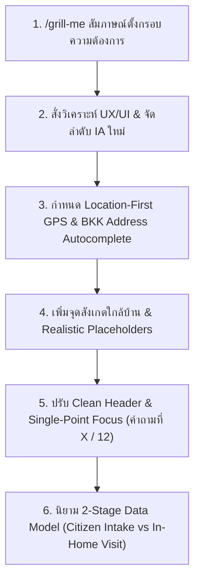

# คู่มือและประวัติขั้นตอนการสั่งงาน AI (AI Prompting & Engineering Guide)

คู่มือนี้รวบรวม **ลำดับขั้นตอนจริง (Trajectory Step-by-Step)** และ **ชุดคำสั่ง Prompt ตามลำดับการพัฒนาจริง** เพื่อให้ทีมพัฒนาและน้องๆ ในทีมสามารถศึกษา ย้อนดู และก๊อปปี้คำสั่งไปใช้กับ AI Coding Assistant เพื่อสร้างระบบเว็บฟอร์มที่มีคุณภาพสูงได้แบบเดียวกัน

---

## 📜 ลำดับขั้นตอนการพัฒนาจริง (Step-by-Step Prompting Trajectory)



---

### Step 1: เริ่มต้นคุยกรอบความคิดด้วย `/grill-me`
* **คำสั่งที่ใช้:**
  ```text
  /grill-me ต้องการทำ form เพื่อรับแจ้งตามจุดประสงค์ของทั้ง 3 ไฟล์
  ```
* **สรุปคำตอบจากการสัมภาษณ์ (Aligning Requirements):**
  * สเต็ปที่เป็นตัวเลือก เลือกแล้ว auto-advance (ไม่ต้องกดปุ่มถัดไป)
  * อันไหนจำเป็น (Required) ให้แสดงป้ายชัดเจน และ Disable ปุ่มถัดไปจนกว่าจะกรอกครบ
  * พิกัดสถานที่ใช้ Leaflet Map ปักหมุดลากเลื่อนได้ หรือดึงตำแหน่ง GPS
  * ข้อมูลผู้ดูแล ให้ถามสภาพการดูแลตัวเองก่อน หากดูแลตัวเองได้ ให้ข้ามการกรอกข้อมูลผู้ดูแล
  * ขั้นตอนสุดท้ายจัดเรียงข้อมูลแบบ UX/UI Review Cards แบ่ง 4 หมวดหมู่

---

### Step 2: วิเคราะห์ฟอร์มตามหลัก UX/UI และตรรกะระบบ
* **คำสั่งที่ใช้:**
  ```text
  วิเคราะห์ตัว form ทั้งหมด ตามหลัก UX/UI และประเมินว่าควรเพิ่มลดแก้ไขอะไรเพราะอะไร ตอบแบบไม่อวย ใช้หลักการและเหตุผล
  ```
* **สิ่งที่ได้จากการสั่ง:**
  * AI ทำการจัดเรียง Information Architecture (IA) ใหม่ เรียงลำดับคำถามตามจิตวิทยาผู้ใช้:  
    `บริบทผู้ยื่น ➔ สิทธิทางการแพทย์ ➔ พิกัดแผนที่ ➔ ที่อยู่ ➔ ยืนยันตัวตน ➔ การดูแล ➔ สรุปยื่นเรื่อง`

---

### Step 3: ปรับสถาปัตยกรรมเป็น Location-First & BKK Address Autocomplete
* **คำสั่งที่ใช้:**
  ```text
  ปรับตัวเลือกให้ส่งพิกัดก่อนดีไหม จะได้นำมาใช้ระบุเขต แขวง ในที่อยู่ปัจจุบันได้ 
  ที่อยู่ปัจจุบัน ควรเลือกแบบ https://github.com/earthchie/jquery.Thailand.js/ ไหม แต่ใช้ได้เฉพาะ กทม.
  ```
* **สิ่งที่ได้จากการสั่ง:**
  * ย้ายปักหมุดแผนที่ GPS มาไว้ **คำถามที่ 4 (Location-First)** เมื่อปักหมุด ระบบจะยิง Reverse Geocoding สกัดเอา แขวง และ เขต มารอเติมให้อัตโนมัติใน **คำถามที่ 5 (ที่อยู่ กทม.)**
  * ในคำถามที่ 5 เพิ่มระบบ **BKK Address Autocomplete** แสดงตัวเลือก แขวง/เขต/รหัสไปรษณีย์ ทันทีเมื่อ Focus ป้องกันการพิมพ์ชื่อแขวงหรือเขตผิด 100%

---

### Step 4: ปรับปรุง UX เพิ่มจุดสังเกตใกล้บ้านและตัวอย่าง Placeholder
* **คำสั่งที่ใช้:**
  ```text
  ควรเพิ่มจุดสังเกตุไหมตอนกรอกที่อยู่ ไม่ required ควรมีตัวอย่างข้อมูลที่ต้องกรอกไหม
  ```
* **สิ่งที่ได้จากการสั่ง:**
  * เพิ่มช่อง *"จุดสังเกตใกล้บ้าน (ไม่บังคับกรอก)"* ช่วยให้ทีมพยาบาลเยี่ยมบ้านของ ศบส. เดินทางไปส่งมอบผ้าอ้อมได้ถูกต้อง
  * เพิ่มตัวอย่าง Realistic Placeholders ในทุกช่องกรอกข้อมูล เช่น `นายสมชาย ใจดี`, `1-2345-67890-12-3`, `0812345678`

---

### Step 5: ปรับปรุง UI Header เป็น Clean Single-Point Focus
* **คำสั่งที่ใช้:**
  ```text
  จากภาพที่ capture มา ส่วน header bkk careplan ควรอยู่กลางไหม และ ข้อ 2/12 ตกบรรทัด ควรปรับอย่างไรดี
  หรือควรเอาข้อที่ 1/12 ออก ไปใส่ตรงคำถามที่ x/y ไปเลยดี
  ```
* **สิ่งที่ได้จากการสั่ง:**
  * ลบ `ข้อที่ X / 12` ออกจาก Top Header ขจัดปัญหาข้อความซ้ำซ้อนและบรรทัดตกบนจอมือถือ
  * ย้ายมาแสดงไว้ในการ์ดคำถามเป็น **`คำถามที่ X / 12`** เพื่อให้สายตาผู้ใช้โฟกัสจุดเดียว (Single-Point Focus)

---

### Step 6: นิยามสถาปัตยกรรมเก็บข้อมูล 2 ระยะ (2-Stage Data Collection Model)
* **คำสั่งที่ใช้:**
  ```text
  จากเอกสารทั้ง 3 ช่วยทำสรุปไว้หน่อยว่า คำถามข้อไหน ตัดออกหรือเอาไปอยู่ตรงไหนใน 12 คำถาม พร้อมเหตุผล ใส่ไว้ใน readme
  แล้วข้อคำถามอื่นๆจากแบบ diapers 01-2 พวก บัตรคนพิการ สถานะสุขภาพ ความต้องการ ข้อความระวัง การดูแล จะไปอยู่ที่ไหนเมื่อไหร่ล่ะ
  ```
* **สิ่งที่ได้จากการสั่ง:**
  * อธิบายสถาปัตยกรรม 2 ระยะ:
    * **Stage 1 (Citizen Intake Form):** 12 ข้อคำถามยื่นเรื่องทางมือถือ สกรีนนิ่งรวดเร็ว
    * **Stage 2 (In-Home Clinical Assessment):** ย้ายการประเมินคะแนน ADL 10 ข้อรายละเอียด, เลขบัตรคนพิการ, ประวัติโรคประจำตัว และข้อระวังทางการแพทย์ ไปไว้ให้พยาบาลวิชาชีพ ศบส. ประเมินเมื่อลงพื้นที่เยี่ยมบ้าน

---

## 🎯 Master Prompt รวมชุดคำสั่ง (สำหรับรวดเดียวจบ)

หากต้องการนำไปสั่ง AI ในการสร้างโปรเจกต์ใหม่รวดเดียว สามารถก๊อปปี้คำสั่ง Master Prompt ด้านล่างนี้ไปใช้ได้ทันที:

```markdown
ช่วยออกแบบและสร้าง Web Application ฟอร์มยื่นเรื่องขอรับสิทธิผ้าอ้อมผู้ใหญ่ กรุงเทพมหานคร ผ่าน Traffy Fondue (Webview) โดยใช้อ้างอิงจากไฟล์เอกสาร 3 ไฟล์ที่แนบมา:
1. `docs/references/2.Diapers 01-2, 02 D3 16-12-2568.pdf`
2. `docs/references/ขั้นตอนการรับผ้าอ้อม Traffy Fondue4-8-2569_5pm.pdf`
3. `okf/module_bkk_careplan.md`

ลำดับและตรรกะการสร้างแอปพลิเคชัน:
1. [Data Architecture]: แบ่งระบบเป็น 2-Stage Data Model 
   - Stage 1 (Citizen Intake): 12 ข้อคำถามย่อยสกรีนนิ่งยื่นเรื่องเบื้องต้น 3 นาทีจบ
   - Stage 2 (Clinical Assessment): ย้าย ADL 10 ข้อ, บัตรคนพิการ, โรคประจำตัว และข้อระวัง ไปไว้ให้พยาบาล ศบส. ประเมินตอนเยี่ยมบ้าน
2. [Location-First & Autocomplete Pipeline]:
   - คำถามที่ 4: พิกัดสถานที่พักอาศัย GPS (Leaflet Map) ปักหมุดยิง Reverse Geocoding
   - คำถามที่ 5: ที่อยู่ กทม. + BKK Autocomplete (ค้นหา แขวง/เขต/รหัสไปรษณีย์) + ช่องจุดสังเกตใกล้บ้าน (ไม่บังคับ)
3. [UI Micro-interactions]:
   - Top Header สะอาด มีปุ่มขยายอักษร 3 ระดับ (A, A+, A++)
   - แสดงลำดับข้อในการ์ดคำถามเป็น `คำถามที่ X / 12` (Single-Point Focus)
   - สเต็ปที่เป็น Radio เลือกแล้ว Auto-advance ทันที
   - ปุ่มถัดไป Disabled หากยังกรอกข้อมูลไม่ครบตาม Validation (เช่น เลขบัตร 13 หลัก)
   - หน้าสุดท้าย (13) แสดงสรุป 4 การ์ดหมวดหมู่ พร้อม Modal แสดง JSON Payload
```
