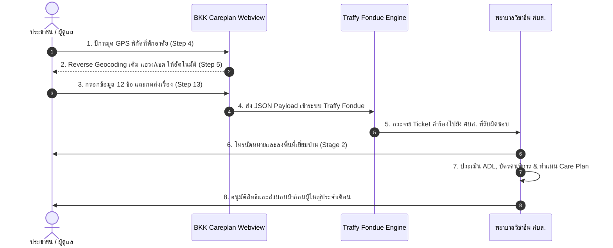

# บริบทและที่มาของโครงการ (BKK Careplan - Traffy Fondue Diaper Request)

## 1. ที่มาและวัตถุประสงค์ (Background & Objective)
โครงการยื่นคำร้องขอรับการสนับสนุนผ้าอ้อมผู้ใหญ่และแผ่นรองซับการขับถ่าย เป็นนโยบายร่วมระหว่าง **กรุงเทพมหานคร (กทม.)**, **สำนักงานหลักประกันสุขภาพแห่งชาติ (สปสช.)**, และ **ศูนย์เทคโนโลยีอิเล็กทรอนิกส์และคอมพิวเตอร์แห่งชาติ (NECTEC)** เพื่อให้ประชาชนกลุ่มผู้ป่วยติดเตียงและผู้มีภาวะกลั้นปัสสาวะ/อุจจาระไม่ได้ ในพื้นที่ 50 เขตของกรุงเทพมหานคร สามารถเข้าถึงสิทธิประโยชน์หลักประกันสุขภาพได้อย่างสะดวก รวดเร็ว และไม่มีค่าใช้จ่าย

โดยระบบเว็บฟอร์มนี้พัฒนาขึ้นเพื่อทำงานเป็น **Webview Integration ร่วมกับแอปพลิเคชัน Traffy Fondue** ช่วยให้ประชาชนและผู้ดูแลสามารถยื่นคำร้องผ่านโทรศัพท์มือถือได้อย่างรวดเร็ว ก่อนส่งต่อข้อมูลไปยัง **ศูนย์บริการสาธารณสุข (ศบส.) ทั้ง 69 แห่ง** ของกรุงเทพมหานคร เพื่อจัดส่งทีมพยาบาลเยี่ยมบ้านลงประเมินและอนุมัติการสนับสนุนต่อไป

---

## 2. แผนผังลำดับขั้นตอนการทำงาน (End-to-End Sequence Diagram)



---

## 3. สถาปัตยกรรมข้อมูลแบบ 2 ระยะ (2-Stage Data Collection Model)

ระบบสวัสดิการผ้าอ้อมผู้ใหญ่ กทม. แบ่งการเก็บข้อมูลออกเป็น 2 ระยะ เพื่อประสิทธิภาพสูงสุด:

```
[ Stage 1: Citizen Webview Form ]  ➔  [ Stage 2: In-Home Clinical Assessment ]
(ประชาชน/ผู้ดูแล ยื่นคำร้องผ่านมือถือ)     (พยาบาลวิชาชีพ ศบส. ประเมินเมื่อเยี่ยมบ้าน)
       • พิกัด GPS & ที่อยู่ กทม.                   • ตรวจสอบบัตรคนพิการ & สิทธิซ้ำซ้อน
       • สภาวะเดือดร้อนเบื้องต้น                      • ประเมินคะแนน ADL 10 ข้อรายละเอียด
       • เลขบัตร 13 หลัก & เบอร์ติดต่อ                 • บันทึกโรคประจำตัว, ข้อระวัง & แผลกดทับ
       • ไซส์ผ้าอ้อม & ผู้ดูแล                         • อนุมัติจำนวนชิ้น/เดือน & Care Plan
```

### Stage 1: Citizen Intake Form (ฟอร์มของประชาชน 12 ข้อคำถาม)
* **เป้าหมาย:** สกรีนนิ่งยื่นคำร้องเบื้องต้น (Screening & Ticket Creation) ภายใน 3-5 นาที
* **เน้นย้ำ:** ข้อมูลสถานที่ (GPS + ที่อยู่), ตัวตน (เลขบัตร 13 หลัก), สิทธิหลัก, สภาวะเดือดร้อน และเบอร์ติดต่อนัดหมาย

### Stage 2: Clinical In-Home Assessment (ฟอร์มการประเมินทางการแพทย์ของ ศบส. - แบบ 01/02)
* **เป้าหมาย:** การอนุมัติสิทธิและจัดทำแผนการดูแล (Official Approval & Care Plan Creation)
* **ผู้กรอก:** พยาบาลวิชาชีพ / นักบริบาลชุมชน ศบส. เมื่อลงพื้นที่เยี่ยมบ้าน (ภายใน 3-7 วันทำการ)
* **หัวข้อที่ประเมินใน Stage 2:**
  1. **บัตรประจำตัวคนพิการ:** เลขบัตรคนพิการ / สิทธิสวัสดิการพม.
  2. **สถานะสุขภาพเชิงลึก:** โรคประจำตัว (สโตรก, สมองเสื่อม, อัมพฤกษ์), แผลกดทับ (Stage 1-4)
  3. **ข้อระวังและคำแนะนำในการดูแล:** สายอาหาร (NG Tube), สายปัสสาวะ (Foley Cath), ภาวะติดเชื้อ, การแพ้วัสดุ
  4. **คะแนน ADL (10 ข้อ):** ประเมินทักษะการดำเนินชีวิตประจำวันอย่างเป็นทางการ เพื่อตั้งเบิกงบประมาณ กองทุนหลักประกันสุขภาพ กทม.
  5. **อนุมัติโควตาผ้าอ้อม:** กำหนดจำนวนชิ้น/วัน (เช่น 3 ชิ้น/วัน ➔ 90 ชิ้น/เดือน)

---

## 4. เอกสารอ้างอิงที่ใช้ในโครงการ (Reference Documents)
* `docs/references/2.Diapers 01-2, 02 D3 16-12-2568.pdf`: หลักเกณฑ์แบบประเมินทางการแพทย์ สปสช. (แบบ 01 และ 02)
* `docs/references/ขั้นตอนการรับผ้าอ้อม Traffy Fondue4-8-2569_5pm.pdf`: กระบวนการประสานงานรับเรื่องผ่าน Traffy Fondue และ ศบส. กทม.
* `okf/module_bkk_careplan.md`: ข้อกำหนดทางเทคนิค โครงสร้างฟอร์ม และ JSON Payload Schema
