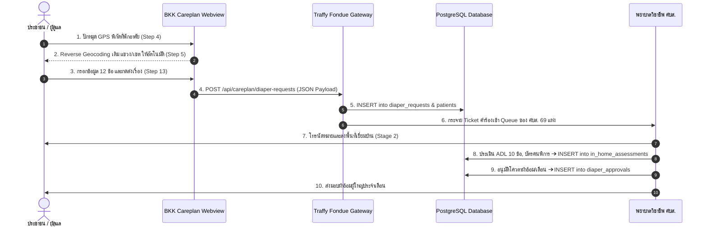
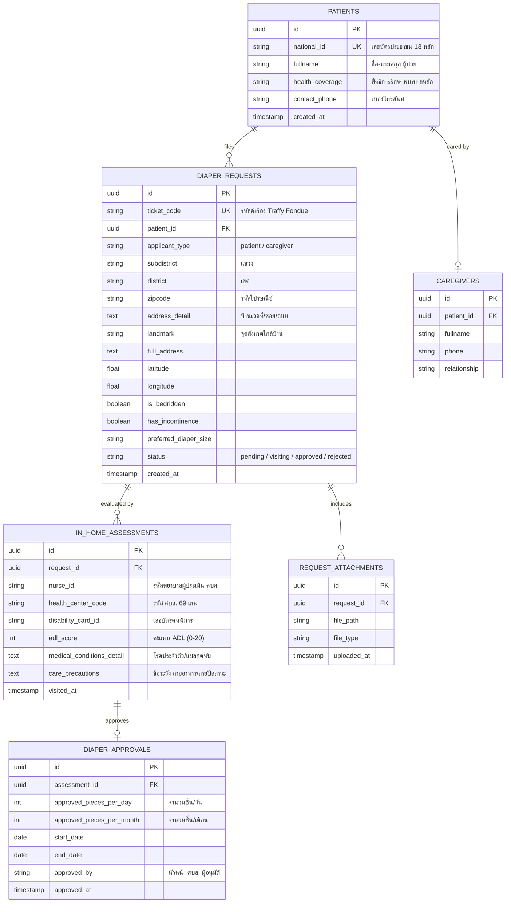

# Operational Knowledge Folder (OKF): BKK Careplan Module

## 📌 Module Overview
* **Module Name:** `bkk_careplan_diaper_form`
* **Domain:** BKK Public Health Care Plan & Adult Diapers Support
* **Target Users:** Citizen (ผู้ป่วย / ญาติผู้ดูแลผู้ป่วย) & Public Health Nurses (พยาบาล ศบส.)
* **Integration Points:** Traffy Fondue Webview, BKK Public Health Centers (ศบส. 69 แห่ง), สปสช., PostgreSQL Database

---

## 🔁 1. End-to-End Sequence Diagram



---

## 🗄️ 2. PostgreSQL Relational Database ER Diagram (Phase 2 Backend Schema)



---

## 🏗️ Technical Specification

### 3. Form Step Pipeline & UX Architecture (13 Steps)
| Step | Field Code | Label (ภาษาไทย) | Input Type | Required | UX & Processing Logic |
| :--- | :--- | :--- | :--- | :--- | :--- |
| 1 | `applicant_type` | สถานะผู้กรอกข้อมูล | Radio Card | Required | เลือก "ผู้ป่วย" หรือ "ญาติ/ผู้ดูแล" |
| 2 | `health_condition` | สภาวะความเดือดร้อน | Checkbox Card | Required | เลือกอย่างน้อย 1 ข้อ ("ติดเตียง" / "กลั้นไม่ได้") |
| 3 | `diaper_size` | ขนาดผ้าอ้อมที่ต้องการ | Radio Card | Optional | เลือก S, M, L, XL หรือ ไม่แน่ใจ |
| 4 | `location_coords` | พิกัดสถานที่พักอาศัย | Leaflet Map | Required | **Location-First:** ปักหมุด GPS ยิง Reverse Geocoding ส่งค่าไป Step 5 |
| 5 | `patient_address` | ที่อยู่ กทม. + จุดสังเกต | Autocomplete & Text | Required | **BKK Address Autocomplete** (แขวง/เขต/รหัสไปรษณีย์) + ช่องจุดสังเกต |
| 6 | `patient_fullname` | ชื่อ-นามสกุล ผู้ป่วย | Text Input | Required | ชื่อและนามสกุลจริงตามบัตรประชาชน |
| 7 | `patient_id_card` | เลขบัตรประชาชน 13 หลัก | Tel Input | Required | Auto-format `X-XXXX-XXXXX-XX-X` + Thai ID Checksum Validation |
| 8 | `health_coverage` | สิทธิการรักษาพยาบาลหลัก | Radio Card | Required | บัตรทอง 30 บาท / ประกันสังคม / ข้าราชการ / อื่นๆ |
| 9 | `contact_phone` | เบอร์โทรศัพท์ติดต่อนัดหมาย | Tel Input | Required | ตัวเลข 9-10 หลัก |
| 10 | `self_care_status` | สภาพการดูแลตัวเอง | Radio Card | Required | เลือก "ดูแลตัวเองได้" หรือ "ต้องมีผู้ดูแล" (ข้าม Step 11 หากดูแลตัวเองได้) |
| 11 | `caregiver_info` | ข้อมูลญาติ/ผู้ดูแล | Text & Tel Input | Conditional | ปรากฏเฉพาะเมื่อ `self_care_status == 'need_caregiver'` |
| 12 | `attachments` | รูปถ่ายแนบประกอบ | File Upload | Optional | อัปโหลดรูปภาพผู้ป่วย/ที่พัก/ใบรับรองแพทย์ |
| 13 | `review_summary` | สรุปข้อมูลการยื่นเรื่อง | Review Grid | - | แสดงการ์ดสรุป 4 หมวดหมู่ พร้อมปุ่มแก้ไขเฉพาะส่วน |

---

## 🔌 JSON Output Payload Schema (`POST /api/careplan/diaper-requests`)

```json
{
  "request_timestamp": "2026-08-06T14:38:00+07:00",
  "source": "bkk_careplan_traffy_fondue_webview",
  "applicant_type": "patient",
  "patient_info": {
    "fullname": "นายสมชาย ใจดี",
    "id_card": "1100200345678",
    "health_coverage": "บัตรทอง"
  },
  "contact_info": {
    "phone": "0812345678",
    "district": "หลักสี่",
    "subdistrict": "ทุ่งสองห้อง",
    "zipcode": "10210",
    "address_detail": "99/1 ซอยวิภาวดี 16 ถนนวิภาวดีรังสิต อาคาร A ชั้น 2",
    "landmark": "ตรงข้ามวัดบางนาใน",
    "full_address": "99/1 ซอยวิภาวดี 16 ถนนวิภาวดีรังสิต อาคาร A ชั้น 2 (จุดสังเกต: ตรงข้ามวัดบางนาใน) แขวงทุ่งสองห้อง เขตหลักสี่ กรุงเทพมหานคร 10210",
    "coordinates": {
      "latitude": 13.8821,
      "longitude": 100.5632
    }
  },
  "medical_conditions": {
    "is_bedridden": true,
    "has_incontinence": false,
    "preferred_diaper_size": "L"
  },
  "caregiver_info": {
    "is_self_care": true,
    "fullname": "",
    "phone": ""
  },
  "attachments_count": 0
}
```
